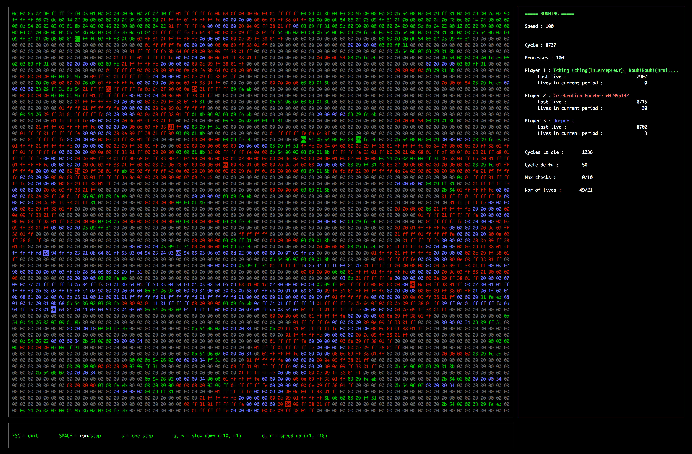

Corewar
=======

About
-----
>Core War is a 1984 programming game created by D. G. Jones and A. K. Dewdney in which two or more battle programs (called "warriors") compete for control of a virtual computer. These battle programs are written in an abstract assembly language called Redcode.

Our [task](docs/corewar.en.pdf) was to rewrite "Corewar" in C for project in school 21 (l'ecole 42). It is a very peculiar game. It’s about bringing “players” together around a “virtual machine”, which will load some “champions” who will fight against one an- other with the support of “processes”, with the objective being for these champions to stay “alive”.

How it looks like?
------------------

How to use it?
---------------
First you'll need to write a .s file with a set of assembly instructions.
You can find this set in either [corewar.pdf](docs/corewar.en.pdf).

Or you can just use one of the many warriors in the resources/champions directory.

Then you'll have to compile it using the asm binary.

Then just execute the corewar binary with your warrior(s) as arguments.

Installation
------------
>git clone https://github.com/daniiomir/corewar.git && cd corewar && make

Works on Mac and Linux.
The ncurse library is needed for visualisation.

Authors
-------

agottlie

swarner

cnikia

rrika
